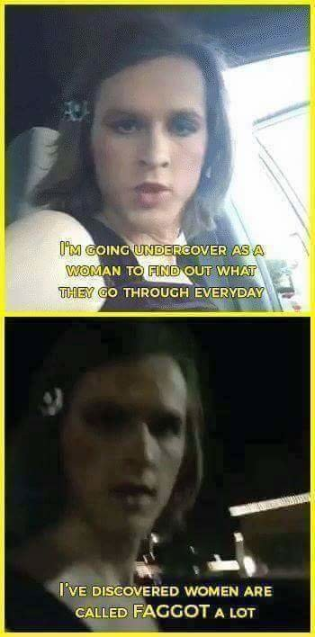

## Some of my interests

I am interested in:

* Cross cultural understanding  and treatment of mental illnesses
    *Psychosis
    *PTSD
    *others
*Sustainable living
    *Non-hierachichal structures
    *circular ecenomy
    *alternatives to violence

My first bigger project was on kin research, you can check out the team I worked with here: [Facelab](http://facelab.org/)

Here is a funny example how a researcher bias might happen.

