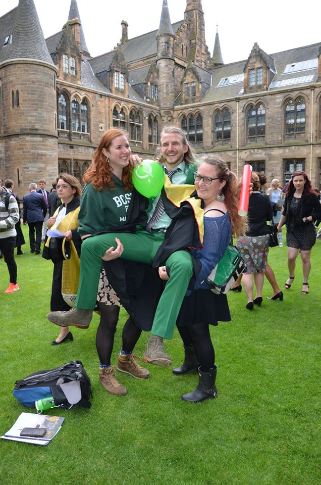

MSc Research Methods of Psychological Sciences student at the [University of Glasgow](https://www.gla.ac.uk/)'s
[Institute of Neuroscience and Psychology](http://www.gla.ac.uk/researchinstitutes/neurosciencepsychology/) and founder of Glasgow's first Virtual Reality Gaming Arcade [VRoomGlasgow](https://www.vroomglasgow.co.uk)

At the moment I work with [Dr Rachael Jack](http://https://www.gla.ac.uk/schools/psychology/staff/rachaeljack//website) on developing models for dynamic social signals of the head with focus on head nodding.

### Some of my interests

I am interested in:

* Cross cultural understanding  and treatment of symptoms and symptom clusters, in particular; psychosis and PTSD. 
    + How does a symptom manifest and how is it measured?
    + Which symptoms are grouped into an illness?
    + The associated Stigma
    + Intersectionalities
    + Treatment trough:
        + Chemicals 
        + Natural remedies
        + Society
        + Institutions
        + Behavioural
               
* Sustainable living
    + Co-op Structures
    + Circular economy
    + Direct Action:
        + Climate
        + Solidarity
        + Community