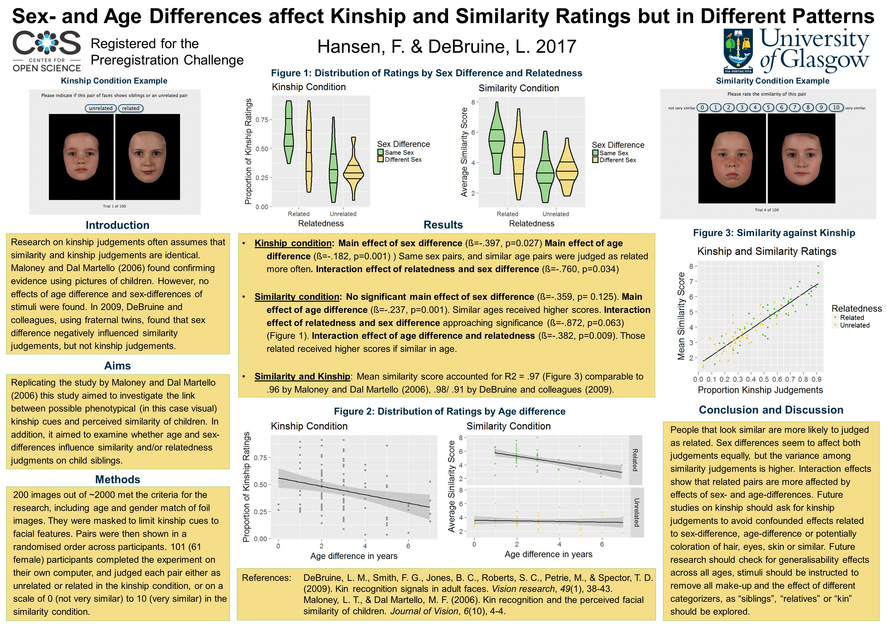

My Dissertation was on facial kinship perception. It is a preregistered replication and will be submitted for publishing shortly after the required participant number is reached. Checkout [Facelab](http://facelab.org/) and the  [KINSHIP](https://erc.europa.eu/projects-figures/erc-funded-projects/results?search_api_views_fulltext=Kinship+moderates+) Project.

## Publications

1. Hansen, F. J., DeBruine, L. M. (2018). Sex difference and age difference affect similarity and kinship ratings in different patterns (In prep manuscript registered for the OSF preregistration challenge)

## Conference Talks

1. **BPS Scottish Branch Undergrad Student Conference, Edinburgh, UK, 27 Mar 2017**  
  Talk: Sex difference and age difference affect similarity and kinship ratings in different patterns

## Posters

1. Dissertation: 

## Research Assistance

1. **Research Assistant, **[University of Glasgow](https://www.gla.ac.uk/)**, UK,	2017**  
  Emotion Expression and Human Robot interaction with [Chaona Chen](https://www.gla.ac.uk/researchinstitutes/neurosciencepsychology/staff/chaonachen/#/publications). Recruited and ran participants. Prepared sections of paper. Tested models and prepared images.

1. **Research Assistant, **[University of Glasgow](https://www.gla.ac.uk/)**, UK, 2017**  
  Eye-tracking study on attentional biases and Trichotillomania with [Jude Stevenson](https://www.gla.ac.uk/schools/psychology/staff/judestevenson/).Independently set up equipment and ran participants. Advanced experiment procedure and assisted with data analysis.

1. **Erasmus+ Funded Research Placement, **[ZUYD-University Heerlen](https://international.zuyd.nl/)**, Netherlands, 2016**  
Created analysis design for possible practice effects and interaction with personality traits during art creation. Was lead on data wrangling. Funded by [Erasmus+](https://www.erasmusplus.org.uk/).
